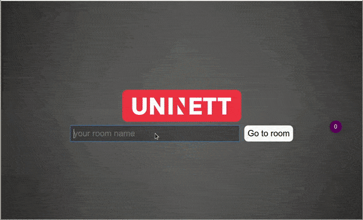

# multiparty-meeting

A WebRTC meeting service using [mediasoup](https://mediasoup.org).



Try it online at https://letsmeet.no. You can add /roomname to the URL for specifying a room.

## Features
* Audio/Video
* Chat
* Screen sharing
* File sharing
* Different layouts
* Internationalization support

## Docker
If you want the automatic approach, you can find a docker image [here](https://hub.docker.com/r/misi/mm/).

## Ansible 
If you want the ansible approach, you can find ansible role [here](https://github.com/misi/mm-ansible/).
[](https://asciinema.org/a/311365)

## Manual installation
* Prerequisites:
Currently multiparty-meeting will only run on nodejs v10.*
To install see here [here](https://github.com/nodesource/distributions/blob/master/README.md#debinstall).

```bash
$ sudo apt install npm build-essentials redis
```

* Clone the project:

```bash
$ git clone https://github.com/havfo/multiparty-meeting.git
$ cd multiparty-meeting
```

* Copy `server/config/config.example.js` to `server/config/config.js` :

```bash
$ cp server/config/config.example.js server/config/config.js
```

* Copy `app/public/config/config.example.js` to `app/public/config/config.js` :

```bash
$ cp app/public/config/config.example.js app/public/config/config.js
```

* Edit your two `config.js` with appropriate settings (listening IP/port, logging options, **valid** TLS certificate, don't forget ip setting in last section in server config: (webRtcTransport), etc).

* Set up the browser app:

```bash
$ cd app
$ npm install
$ npm run build
```
This will build the client application and copy everythink to `server/public` from where the server can host client code to browser requests.

* Set up the server:

```bash
$ cd ..
$ cd server
$ npm install
```

## Run it locally

* Run the Node.js server application in a terminal:

```bash
$ cd server
$ npm start
```
* Note: Do not run the server as root. If you need to use port 80/443 make a iptables-mapping for that or use systemd configuration for that (see further down this doc).
* Test your service in a webRTC enabled browser: `https://yourDomainOrIPAdress:3443/roomname`

## Deploy it in a server

* Stop your locally running server. Copy systemd-service file `multiparty-meeting.service` to `/etc/systemd/system/` and check location path settings:
```bash
$ cp multiparty-meeting.service /etc/systemd/system/
$ edit /etc/systemd/system/multiparty-meeting.service
```

* Reload systemd configuration and start service:

```bash
$ systemctl daemon-reload
$ systemctl start multiparty-meeting
```

* If you want to start multiparty-meeting at boot time:
```bash
$ systemctl enable multiparty-meeting
```

## Ports and firewall

* 3443/tcp (default https webserver and signaling - adjustable in `server/config.js`)
* 4443/tcp (default `npm start` port for developing with live browser reload, not needed in production environments - adjustable in app/package.json)
* 40000-49999/udp/tcp (media ports - adjustable in `server/config.js`)

## Load balanced installation
To deploy this as a load balanced cluster, have a look at [HAproxy](HAproxy.md).

## Learning management integration
To integrate with an LMS (e.g. Moodle), have a look at [LTI](LTI/LTI.md).

## TURN configuration

* You need an additional [TURN](https://github.com/coturn/coturn)-server for clients located behind restrictive firewalls! Add your server and credentials to `app/config.js`

## Authors

* Håvar Aambø Fosstveit
* Stefan Otto
* Mészáros Mihály


This started as a fork of the [work](https://github.com/versatica/mediasoup-demo) done by:
* Iñaki Baz Castillo [[website](https://inakibaz.me)|[github](https://github.com/ibc/)]


## License

MIT


Contributions to this work were made on behalf of the GÉANT project, a project that has received funding from the European Union’s Horizon 2020 research and innovation programme under Grant Agreement No. 731122 (GN4-2). On behalf of GÉANT project, GÉANT Association is the sole owner of the copyright in all material which was developed by a member of the GÉANT project.

GÉANT Vereniging (Association) is registered with the Chamber of Commerce in Amsterdam with registration number 40535155 and operates in the UK as a branch of GÉANT Vereniging. Registered office: Hoekenrode 3, 1102BR Amsterdam, The Netherlands. UK branch address: City House, 126-130 Hills Road, Cambridge CB2 1PQ, UK.
